# GrainFullAndroid
赤槿 - 小满APP

## 初衷
    从事研发多年沉淀下来的经验积累，想形成一个独立的产品：两个维度，一个是有趣好玩，二是对专业人员有用的工具。
    想做成后放到公司试用，先从部门再到公司集团，后期想投放到市场。
    各位领导帮我多多宣传，有什么好的意见和建议欢迎提出。

## 功能介绍

### 华为平台：
    识别银行卡、识别身份证、图片提取文字、动态手势识别、活体检测、人脸对比、图片滤镜、图片裁剪、场景动效；

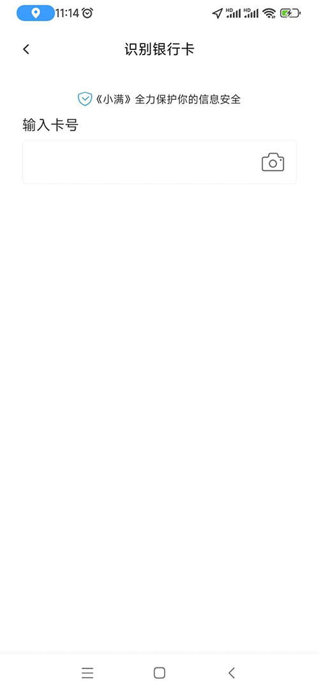
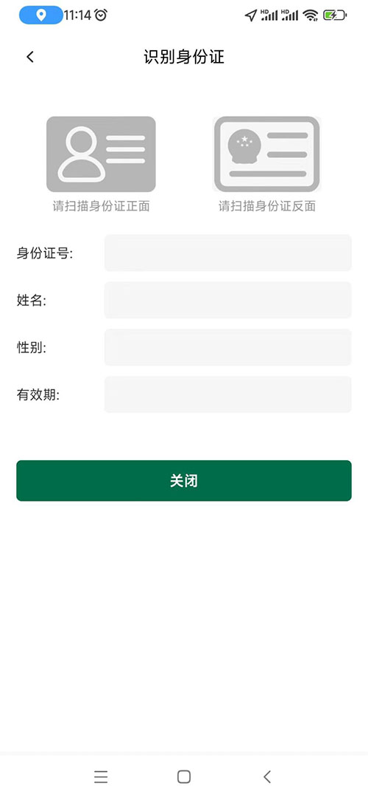
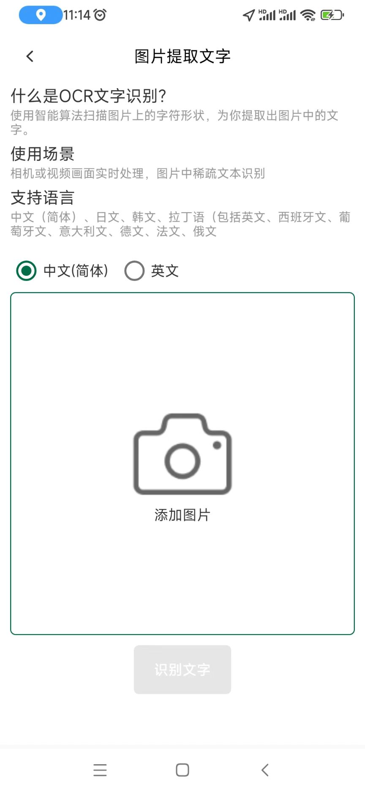
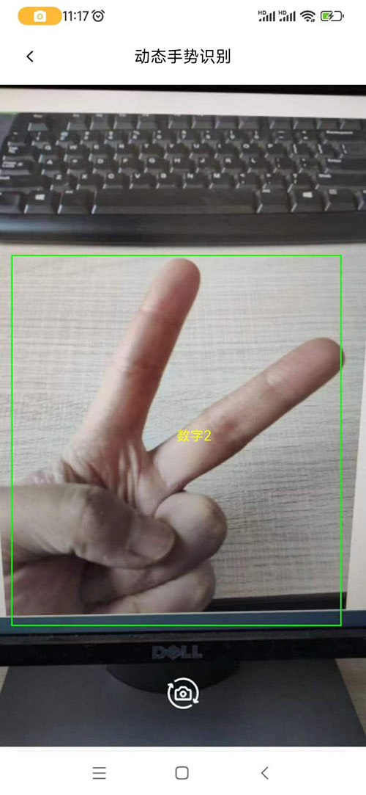
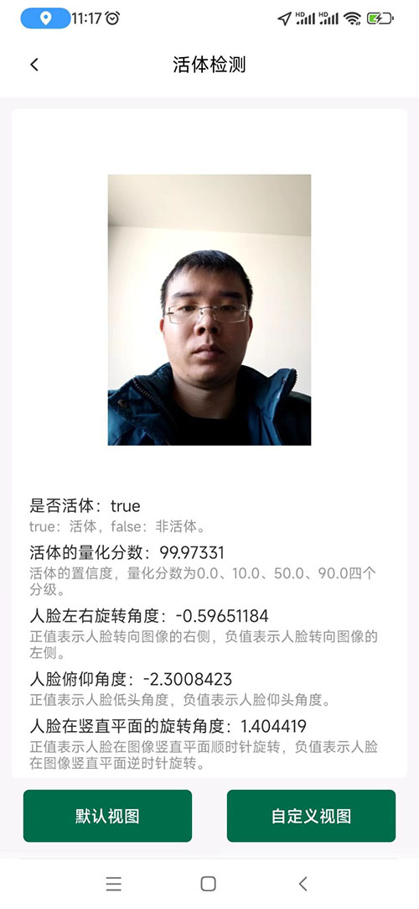
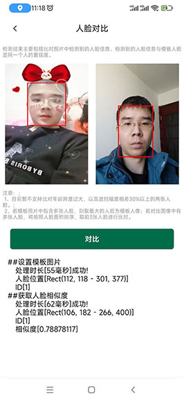
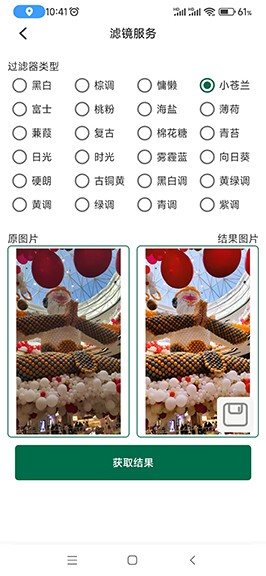
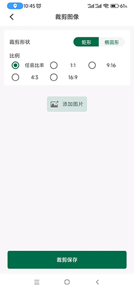
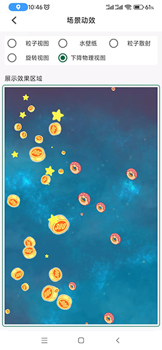

### 百度平台：
    人脸采集、语音识别、语音合成；

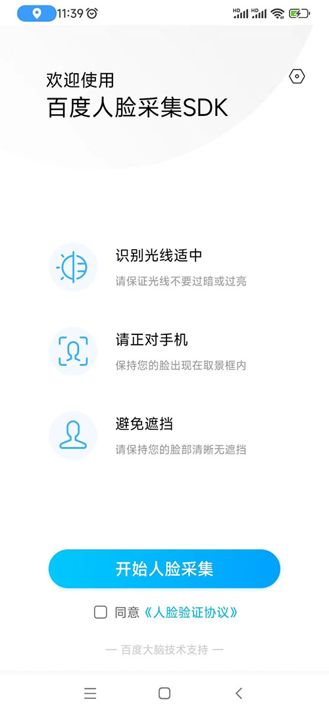
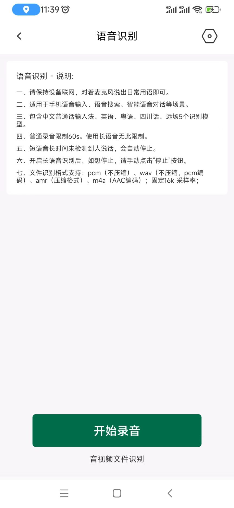
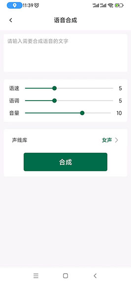

### 颜色：
    取色板、吸管工具、颜色码转换；

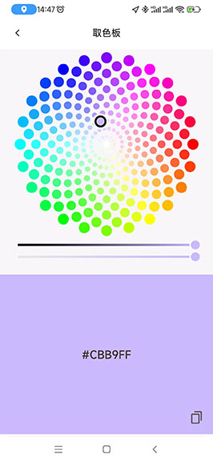
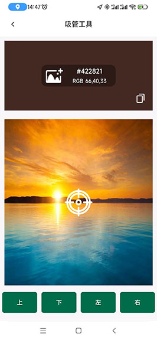
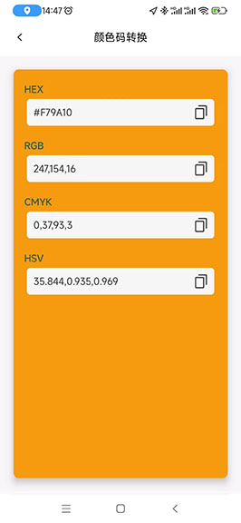

### 文字：
    数字转中文、中文转拼音、手持弹幕、翻译；

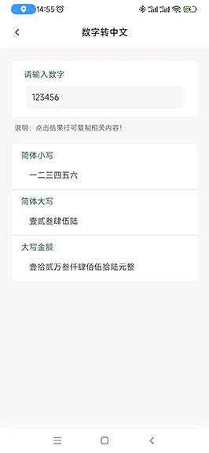
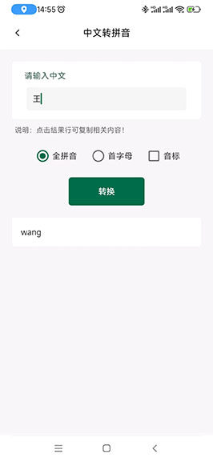
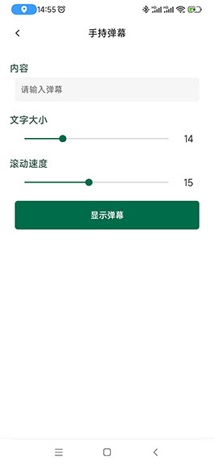


### 图片：
    图片拼接、九宫格切图、图片压缩、人像动漫化、文档图片去水印；

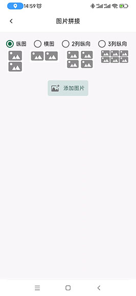
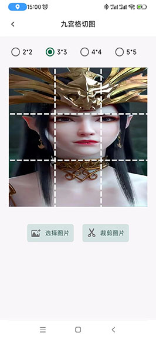

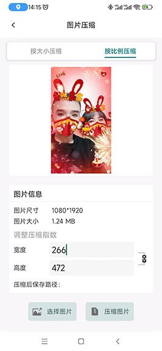
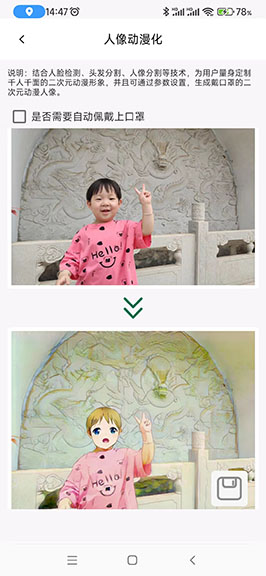

### 设备：
    查看设备信息、金属探测仪、噪音测量；

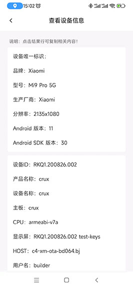
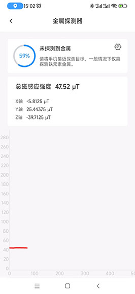
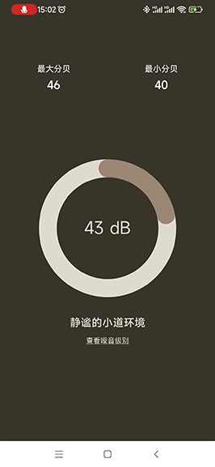

### 其它：
    音频转换、做个决定、放大镜、记分牌、计时器、计算经纬度距离等；

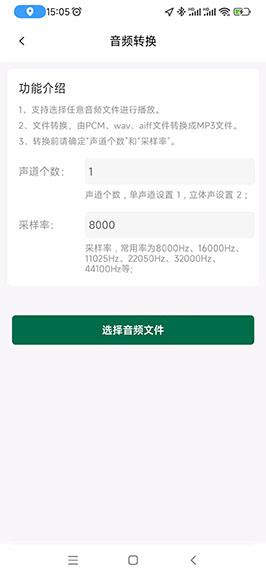
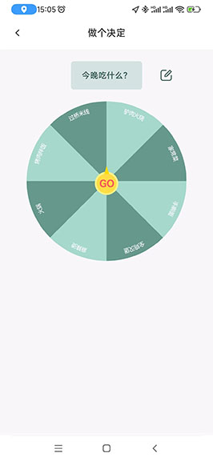

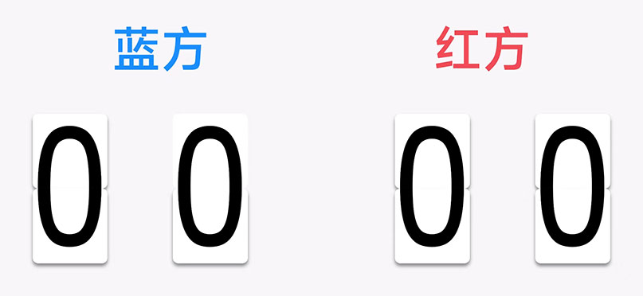
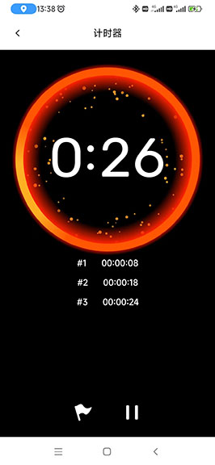
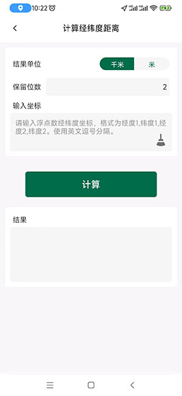

## 游戏
### 普通游戏：
    华容道、飞机大战、打地鼠、一笔画完、卡牌消消乐、随机抽；

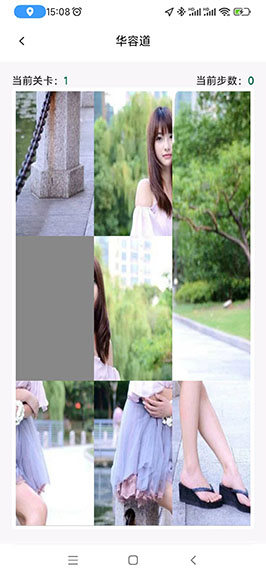
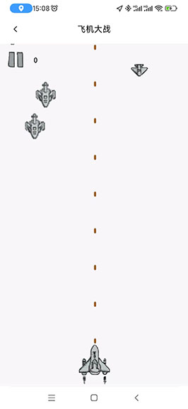
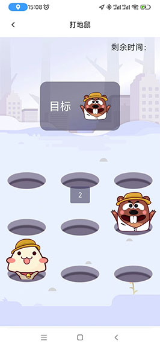
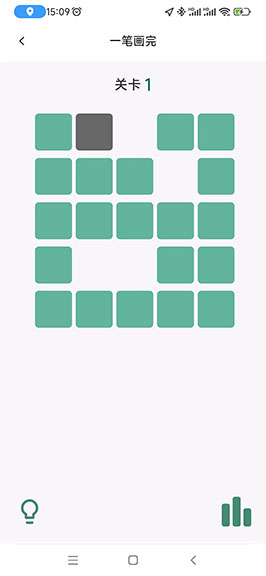
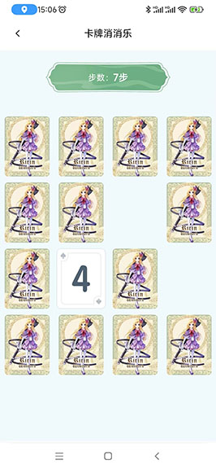
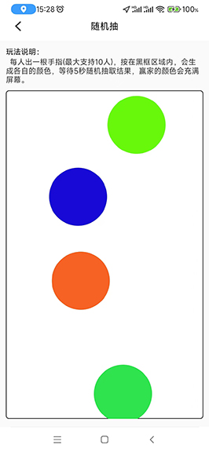

## 特效介绍
### 模仿：
    首页2.0、卡片重叠滑动；

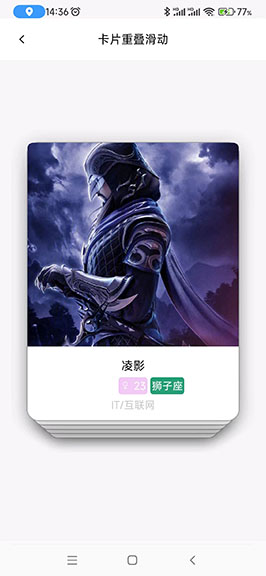

### 文本：
    仿序列号；

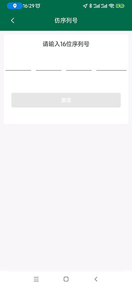

### 时钟：
    时钟、翻转时钟、罗盘时钟、电子时钟；

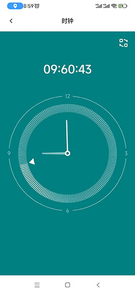
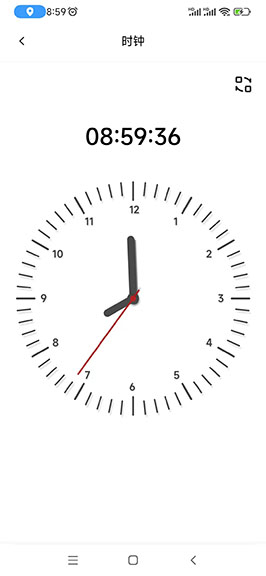
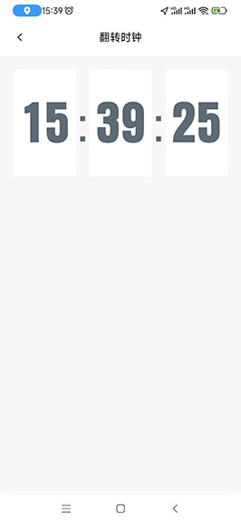
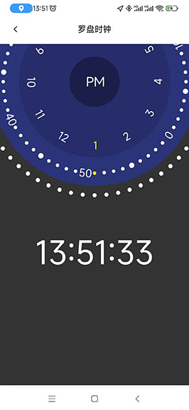
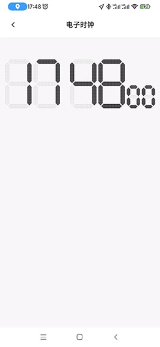

### 其它：
    音频波形、抽奖转盘、蛛网等级、进度条、悬浮窗口/按钮、仪表盘、刻度尺、进化图、升温效果、商品-横滑动、雷达效果、趋势图、统计效果、点赞效果、水波纹效果、底部弹出框、表格式列表、语音动画视图；

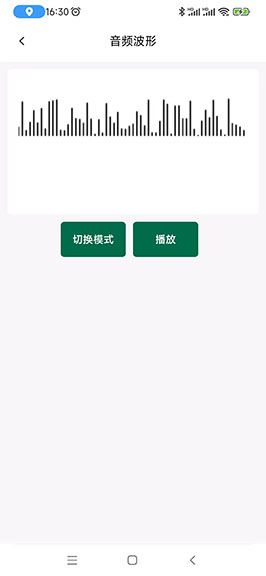
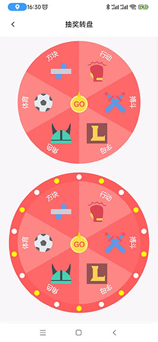
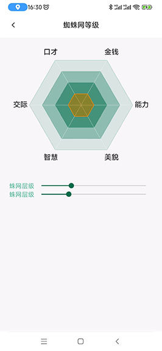

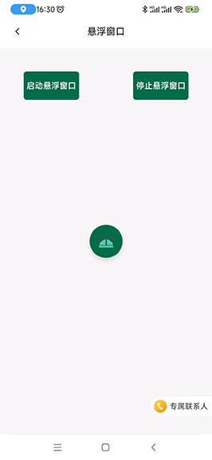
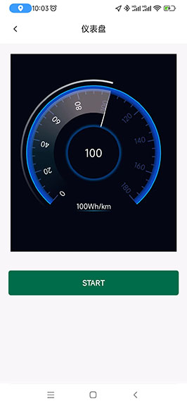
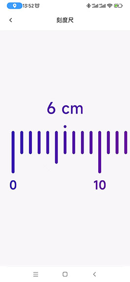
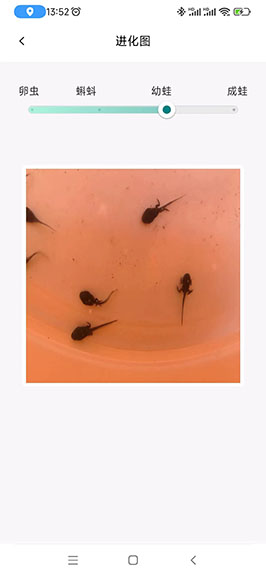


## 首页侧滑
    友盟数据统计、设置、关于；


## Wiki
* [小满APP 升级日志](https://github.com/wangliyang206/GrainFullAndroid/wiki/UpdateLog)

## Donate
    如果它对你帮助很大，在实际开发中切实的提升了您的工作效率和开发能力，并且你很想支持库的后续开发和维护,
    请您点击右上角 Star 支持一下谢谢!

## License
``` 
 Copyright 2022, 赤槿       
  
   Licensed under the Apache License, Version 2.0 (the "License");
   you may not use this file except in compliance with the License.
   You may obtain a copy of the License at 
 
       http://www.apache.org/licenses/LICENSE-2.0 

   Unless required by applicable law or agreed to in writing, software
   distributed under the License is distributed on an "AS IS" BASIS,
   WITHOUT WARRANTIES OR CONDITIONS OF ANY KIND, either express or implied.
   See the License for the specific language governing permissions and
   limitations under the License.
```